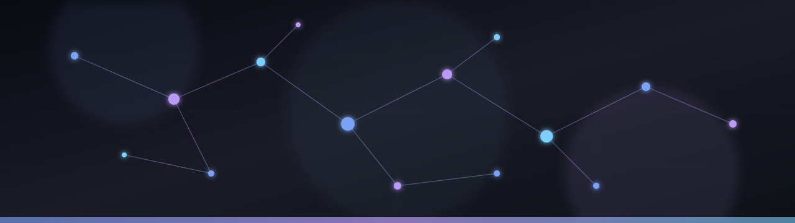

  

 

  

 

  

---

### ⚡ Sobre

**Vinícius Morales** — Técnico de Desenvolvimento de Sistemas.  
Construo software com foco em resiliência, clareza de domínio e entrega real.

Stack principal: **Python** e **Flutter**.  
Projeto que concentra a maior parte da minha atenção: **[fieldnode](https://github.com/Desmantelar-bit/fieldnode)**.

---

### 🔥 Flagship

<table>
<tr>
<td width="65%">

### [fieldnode](https://github.com/Desmantelar-bit/fieldnode)

Projeto core em **Python**.  
Espaço de experimentação arquitetural, nós e engenharia ativa — o repositório mais vivo do perfil.

  
  
  

</td>
<td width="35%" align="center">
  
</td>
</tr>
</table>

---

### 🛠️ Stack

  

---

### 📊 Stats

  
  

 

  

---

### 📫 Contato

  
  
  
  

 

  

